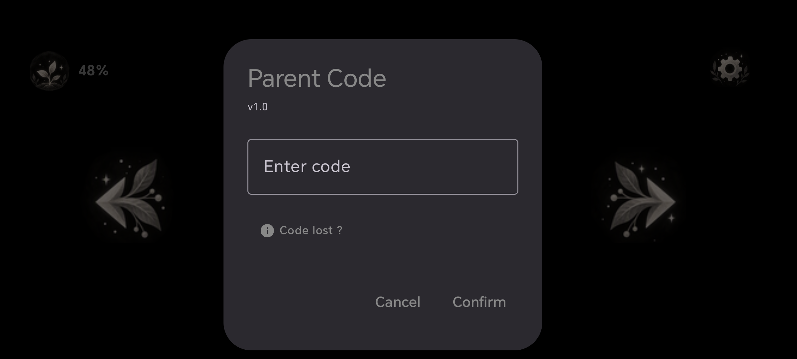
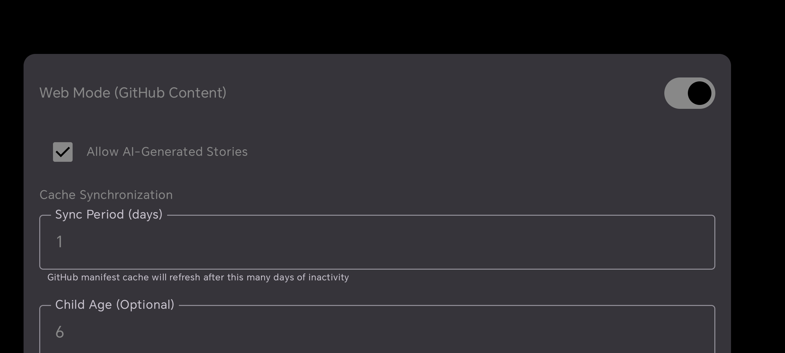
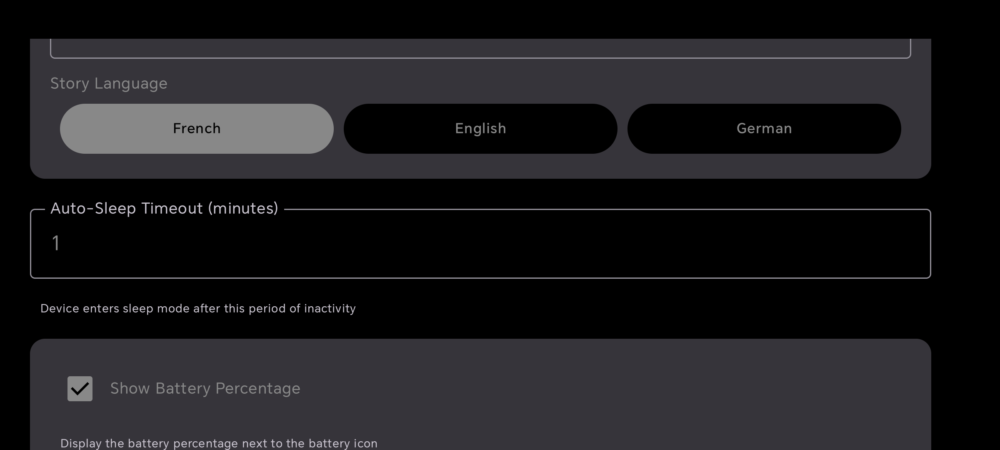
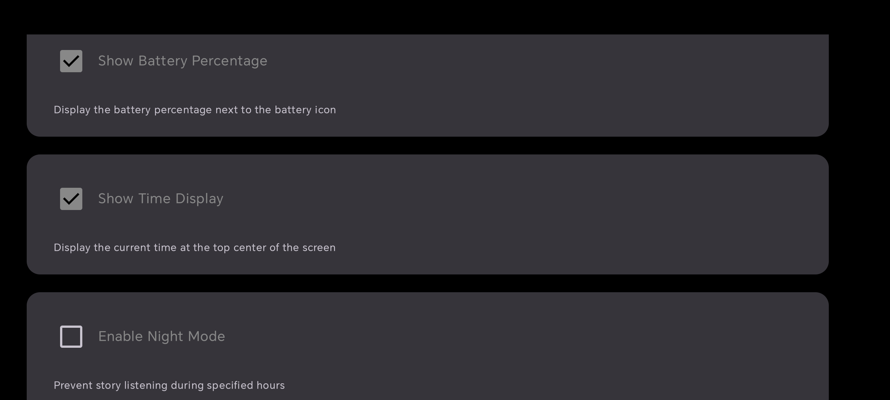
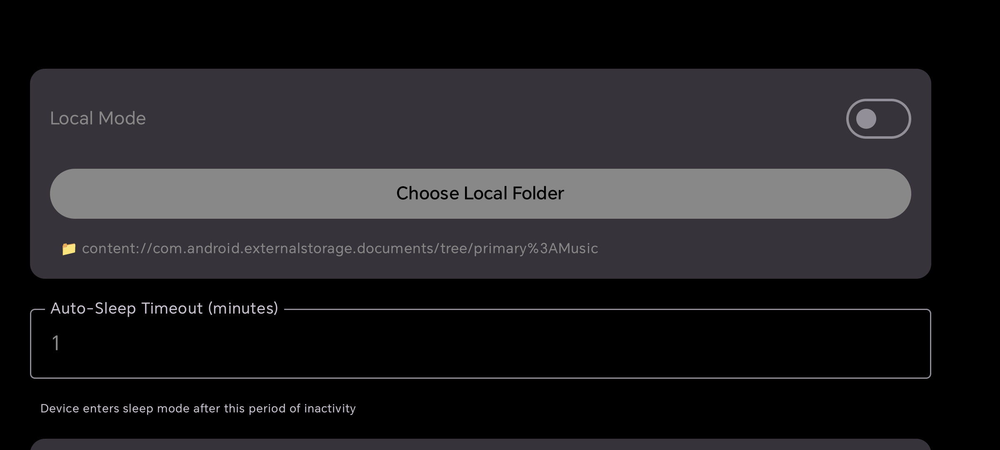
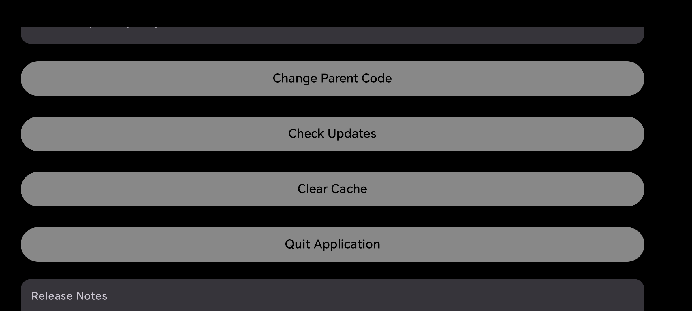

# Aroli - Kids' Kiosk Story App

## Disclaimer
 
Aroli is provided free of charge and "as is", without any warranty of any kind, either express or implied. The authors and contributors cannot be held liable for any damages, losses, or issues resulting from the use of this software.
 
By using Aroli, you acknowledge that you are solely responsible for your actions and for complying with any applicable laws, regulations, and third-party terms of service.

> **[Jump to French Version](#aroli---application-de-contes-en-mode-kiosque-pour-enfants)**

## 📱 About Aroli

Aroli is a secure, kid-friendly story playback application designed for Android tablets in **kiosk mode**. Parents can set up a device as a locked-down entertainment station where children can browse and listen to age-appropriate, AI-generated stories in multiple languages.

### Key Features

- 🔒 **Device Owner Kiosk Mode** - Full-screen lock, no system navigation, unpin-proof
- 👨‍👩‍👧 **Parental Controls** - PIN-protected settings menu with content filtering
- 🤖 **AI Story Filter** - Enable/disable AI-generated stories
- 👶 **Age-Based Recommendations** - Filter content by child's age
- 🌍 **Multi-Language Support** - Select story language (French, English, German)
- 📚 **Two Content Modes**:
  - **Web Mode**: Stories hosted on GitHub (always up-to-date)
  - **Local Mode**: Stories from device folder (offline, no internet needed)
- 🎨 **Kid-Friendly Dark Theme** - Comfortable for extended viewing
- ✋ **Large Touch Targets** - Easy tapping for small hands
- 🎯 **Tap-to-Play** - One tap plays stories, auto-play disabled
- 💤 **Sleep Mode** - Auto-locks screen after inactivity (configurable)
- 📦 **Automatic Updates** - Check for new versions via GitHub

### Screenshots

**Story Playback Screen:**


**Sleep Mode:**


**Parent Code Dialog:**


**Parent Settings - Web Mode:**


**Parent Settings - Story Language:**


**Parent Settings - Display Options:**


**Parent Settings - Local Mode:**


**Parent Settings - Actions:**


---

## 📖 Story Manager Tool

Manage your stories easily with the **Aroli Story Manager** web tool!

### Quick Start

```bash
cd content
start.bat
```

Or manually:
```powershell
cd content
node server.js
# Then open: http://localhost:3000/story-manager-server.html
```

### Features

- ✅ Add stories with auto-generated IDs
- ✅ Edit story metadata and replace files
- ✅ Delete stories (removes audio, image, and updates manifest)
- ✅ Bilingual interface (English/Français)
- 📋 Auto-updates `manifest.json`
- 📥 Download manifest for backup

**See [`content/README.md`](./content/README.md) for detailed instructions.**

---

## 🚀 Installation

### Prerequisites

- **Android Device**: HONOR 70 or similar (Android 13+, minSdk 29, targetSdk 34)
- **ADB Tools**: Android Debug Bridge (`adb` command-line tool)
- **Computer**: Windows/Mac/Linux with USB debugging enabled
- **USB Cable**: For ADB connection or WiFi debugging

---

## ⚡ Quick Start (Easiest Way)

### Download Pre-built APK from GitHub Releases

1. Go to [Aroli Releases](../../releases) (or click **Releases** on the right)
2. Download the latest `aroli-release.apk` or `app-release.apk`
3. **Option A (Automatic)**: Run the installation script
   - **Windows**: Double-click `install.bat`
   - **Mac/Linux**: Run `chmod +x install.sh && ./install.sh`
4. **Option B (Manual)**: Follow **Steps 1-5** below

The installation script automates the ADB process and is the easiest way to share with others!

---

## 🔧 Manual Build & Installation (For Developers)

### Step 1: Enable Developer Mode on Android Device

1. Go to **Settings** → **About Phone**
2. Tap **Build Number** 7 times until "Developer Mode" is enabled
3. Go back to **Settings** → **Developer Options**
4. Enable **USB Debugging** and **WiFi Debugging**

### Step 2: Connect Device via ADB

**USB Connection:**
```bash
adb devices  # Lists connected devices
```

**WiFi Connection:**
```bash
adb connect <DEVICE_IP>:5555  # Find IP in Developer Options
```

### Step 3: Install Aroli APK

```bash
adb install app/build/outputs/apk/debug/app-debug.apk
```

### Step 4: Enable Device Owner Mode (Factory Reset Required)

⚠️ **WARNING**: This step **requires a factory reset** of the device.

1. **Factory reset the device:**
   - Settings → System → Reset Options → Erase All Data
   - Or via ADB: `adb shell am dpm wipe-data`

2. **Set up ADB with no user account:**
   - Complete initial Android setup but **skip adding Google Account**
   - Keep the device in initial setup

3. **Enroll as Device Owner via ADB:**
   ```bash
   adb shell dpm set-device-owner com.aroli.storybox/.AdminReceiver
   ```

   **Expected output:**
   ```
   Success: Device owner set to package com.aroli.storybox/.AdminReceiver
   ```

4. **Verify enrollment:**
   ```bash
   adb shell dpm list-devices-owners
   ```

   Should output:
   ```
   Device owner for user: 0 is com.aroli.storybox/.AdminReceiver
   ```

### Step 5: Launch Aroli

```bash
adb shell am start -n com.aroli.storybox/.MainActivity
```

---

## 📖 How to Use

### Starting the App

1. **Launch Story Playback**: Tap the app icon or use ADB to start
2. **Main Screen**: Stories appear as centered cards with cover art
3. **Browse Stories**: Use **left/right arrows** to navigate
4. **Play Story**: Tap **center of the card** (auto-play disabled, always manual)

### Accessing Parent Settings

1. **Tap the gear icon** ⚙️ in the top-right corner
2. **Enter Parent Code**: 
   - **Default code**: `000000`
   - **Backup code** (if you forgot your code): `568749`
3. **Access Settings Menu**: Now you can modify app configuration
4. **Lost your code?** Click "Code lost ?" link to go to GitHub

### Parent Settings Menu

#### 1. **Content Mode**
- **Web Mode** (Default): Fetch stories from GitHub (online)
- **Local Mode**: Load stories from device folder (offline)
- Switch via toggle at top of settings

#### 2. **Web Mode Settings** (GitHub Content)
- **Allow AI-Generated Stories**: Enable/disable AI stories
- **Child Age**: Set age for content filtering (optional)
- **Story Language**: Select language - **French**, **English**, or **German**
  - Only stories matching the language will appear

#### 3. **Local Mode Settings** (Offline)
- **Choose Local Folder**: Pick a device folder with story files
- **Folder Path**: Shows selected folder location

#### 4. **Actions**
- **Change Parent Code**: Set a new 6-digit PIN (default: `000000`, backup: `568749`)
- **Check Updates**: Look for new app versions on GitHub
- **Clear Cache**: Remove downloaded stories and manifests
- **Quit Application**: Exit kiosk mode (requires original parent code)

#### 5. **Release Notes**
- View version history and features at bottom of settings

### Quitting the App

⚠️ Only the parent can quit via the **"Quit Application"** button in settings (requires PIN).

In Device Owner mode, standard Android "back" gesture and task switcher are disabled.

---

## 🎵 Story Content Management

### Adding New Stories (Easy Way!)

Use the **Aroli Story Manager** web tool:
1. Navigate to `content/` folder
2. Run `start.bat` to launch the manager
3. Add stories through the web interface
4. Stories auto-save to `manifest.json`

**See [`content/README.md`](./content/README.md) for full instructions.**

### Story Metadata

Each story in `manifest.json` includes:

```json
{
  "id": "story-id-1695292800",
  "title": "Story Title",
  "audioFile": "story-id.mp3",
  "imageFile": "story-id.png",
  "language": "fr",           // ISO 639-1: "fr"=French, "en"=English, etc.
  "ai": true,                 // true=AI-generated, false=human-created
  "publishedDate": "2026-09-29",
  "ageMin": 3,                // Minimum age recommendation
  "ageMax": 8                 // Maximum age recommendation
}
```

---

## 🔧 Technical Details

### App Architecture

- **Language**: Kotlin 2.0.20
- **UI Framework**: Jetpack Compose with Material3
- **Audio**: ExoPlayer 1.4.1 (Media3)
- **Storage**: DataStore Preferences (app settings)
- **Content Format**: JSON (manifest), MP3 (audio), PNG (images)

### Project Structure

```
Aroli/
├── app/src/main/
│   ├── java/com/aroli/storybox/
│   │   ├── MainActivity.kt              # Main app entry point
│   │   ├── ui/                          # Compose screens
│   │   │   ├── StoryBoxScreen.kt        # Story playback UI
│   │   │   ├── ParentSettingsScreen.kt  # Settings menu
│   │   │   └── ParentCodeDialog.kt      # PIN entry dialog
│   │   ├── data/                        # Data layer
│   │   │   ├── StoryRepository.kt       # Story sources
│   │   │   ├── GitHubContentRepository.kt
│   │   │   ├── LocalFolderRepository.kt
│   │   │   ├── FilteredStoryRepository.kt
│   │   │   └── AppSettings.kt           # Preferences
│   │   └── util/                        # Utilities
│   │       ├── UpdateChecker.kt         # Version checking
│   │       └── VersionInfo.kt           # App metadata
│   ├── res/
│   │   ├── mipmap/                      # App icons
│   │   ├── xml/device_admin.xml         # Device Owner config
│   │   └── values/strings.xml
│   └── AndroidManifest.xml              # App permissions
└── content/                              # Story content (GitHub-hosted)
    ├── manifest.json                    # Story listing
    ├── audio/                           # MP3 files
    └── images/                          # PNG cover art
```

### Permissions Required

```xml
<uses-permission android:name="android.permission.INTERNET" />
<uses-permission android:name="android.permission.ACCESS_NETWORK_STATE" />
```

### Device Admin Receiver

The `AdminReceiver.kt` component:
- Listens for Device Owner lifecycle events
- Manages lock task mode configuration
- Prevents standard Android gesture-based unpin

---

## 🐛 Troubleshooting

### Device Owner Enrollment Fails

**Error**: `"Can only set device owner on a brand new device with no existing accounts"`

**Solution**:
1. Factory reset the device completely
2. Do NOT sign into any Google account during setup
3. Keep device in initial setup state
4. Run `adb shell dpm set-device-owner` before completing setup

### Stories Not Appearing

**Check Web Mode:**
- Verify internet connection
- Confirm GitHub account settings are public
- Clear cache and restart app

**Check Local Mode:**
- Ensure folder contains story files
- Check file permissions (read access)

**Check Filters:**
- Verify child age matches story age range
- Confirm language matches story language
- Check if AI filter is hiding AI stories

### Parent Code Forgotten

- **Try backup code**: `568749` (works as access code if you forgot your custom PIN)
- Last resort: Factory reset device and re-enroll as Device Owner
- Default code on fresh install: `000000`

### App Won't Quit

- Press the **"Quit Application"** button in Parent Settings (requires correct PIN)
- If stuck, restart device or use: `adb shell am force-stop com.aroli.storybox`

---

## � Creating & Sharing Releases

### Automated GitHub CI/CD

This project uses **GitHub Actions** to automatically build and release APKs. Releases are created whenever you push a version tag.

#### Creating a New Release:

1. **Update version in `app/build.gradle.kts`:**
   ```kotlin
   versionCode = 2          // Increment this
   versionName = "1.1"      // Update this to semantic version
   ```

2. **Commit your changes:**
   ```bash
   git add app/build.gradle.kts
   git commit -m "Release v1.1"
   ```

3. **Create and push a version tag:**
   ```bash
   git tag v1.1
   git push origin v1.1
   ```

4. **GitHub Actions automatically:**
   - ✅ Builds the release APK
   - ✅ Creates a GitHub Release page
   - ✅ Attaches the APK to the release
   - ✅ Generates release notes

5. **Share the link:** Users can download from `https://github.com/yourusername/Aroli/releases`

#### Manual Release Trigger:

You can also manually trigger a build from GitHub:
1. Go to **Actions** tab on GitHub
2. Click **Build and Release APK**
3. Click **"Run workflow"** (right side)
4. Choose branch and click **"Run workflow"**

#### For Users (Distribution):

**Easiest Method:**
1. Download APK from [GitHub Releases](../../releases)
2. Run `install.bat` (Windows) or `./install.sh` (Mac/Linux)
3. Done!

---

## �📝 License

This project is licensed under the GNU General Public License v3.0 (GPLv3).
You are free to use, modify, and distribute this software under the terms of the GPLv3 license.
See the [LICENSE](LICENSE) file for details.

---

<br><br><br>

# Aroli - Application de Contes en Mode Kiosque pour Enfants

> **[Retour à la Version Anglaise](#-about-aroli)**

## Avertissement
 
Aroli est un projet gratuit et open source fourni sans aucune garantie.
 
Chaque utilisateur est entièrement responsable de son utilisation du logiciel et des actions effectuées avec celui-ci. Les auteurs ne peuvent être tenus responsables des éventuels problèmes, dommages ou conséquences liés à son utilisation.
 
En utilisant Aroli, vous acceptez de le faire à vos propres risques.

## 📱 À propos d'Aroli

Aroli est une application sécurisée de lecture de contes adaptée aux enfants, conçue pour fonctionner sur tablettes Android en **mode kiosque**. Les parents peuvent configurer un appareil verrouillé où les enfants peuvent naviguer et écouter des histoires générées par IA appropriées à leur âge et disponibles en plusieurs langues.

### Fonctionnalités Principales

- 🔒 **Mode Kiosque Device Owner** - Écran plein, pas de navigation système, impossible à dépinner
- 👨‍👩‍👧 **Contrôles Parentaux** - Menu de paramètres protégé par code PIN
- 🤖 **Filtre Histoires IA** - Activer/désactiver les histoires générées par IA
- 👶 **Recommandations par Âge** - Filtrer le contenu selon l'âge de l'enfant
- 🌍 **Support Multilingue** - Sélectionner la langue des histoires (Français, Anglais, Allemand)
- 📚 **Deux Modes de Contenu**:
  - **Mode Web**: Histoires hébergées sur GitHub (toujours à jour)
  - **Mode Local**: Histoires depuis le dossier de l'appareil (hors ligne, pas d'internet)
- 🎨 **Thème Sombre Adapté aux Enfants** - Confortable pour une visualisation prolongée
- ✋ **Grandes Zones de Toucher** - Facile à taper pour les petites mains
- 🎯 **Appui pour Lire** - Une seule tape pour lire, lecture automatique désactivée
- 📦 **Mises à Jour Automatiques** - Vérifier les nouvelles versions via GitHub

### Captures d'Écran

**Écran de Lecture des Histoires:**


**Mode Veille:**


**Dialogue Code Parent:**


**Paramètres Parentaux - Mode Web:**


**Paramètres Parentaux - Langue des Histoires:**


**Paramètres Parentaux - Options d'Affichage:**


**Paramètres Parentaux - Mode Local:**


**Paramètres Parentaux - Actions:**


---

## 🚀 Installation

### Prérequis

- **Appareil Android**: HONOR 70 ou similaire (Android 13+, minSdk 29, targetSdk 34)
- **Outils ADB**: Android Debug Bridge (outil en ligne de commande `adb`)
- **Ordinateur**: Windows/Mac/Linux avec débogage USB activé
- **Câble USB**: Pour la connexion ADB ou débogage WiFi

### Étape 1 : Activer le Mode Développeur sur l'Appareil Android

1. Allez à **Paramètres** → **À propos du Téléphone**
2. Appuyez **7 fois** sur **Numéro de Build** jusqu'à l'activation du "Mode Développeur"
3. Retournez à **Paramètres** → **Options pour les Développeurs**
4. Activez **Débogage USB** et **Débogage WiFi**

### Étape 2 : Connecter l'Appareil via ADB

**Connexion USB:**
```bash
adb devices  # Liste les appareils connectés
```

**Connexion WiFi:**
```bash
adb connect <IP_APPAREIL>:5555  # Trouvez l'IP dans les Options pour Développeurs
```

### Étape 3 : Installer l'APK Aroli

```bash
adb install app/build/outputs/apk/debug/app-debug.apk
```

### Étape 4 : Activer le Mode Device Owner (Réinitialisation d'Usine Requise)

⚠️ **ATTENTION**: Cette étape **nécessite une réinitialisation d'usine** de l'appareil.

1. **Réinitialiser l'appareil:**
   - Paramètres → Système → Options de Réinitialisation → Effacer Toutes les Données
   - Ou via ADB: `adb shell am dpm wipe-data`

2. **Configurer ADB sans compte utilisateur:**
   - Effectuez la configuration initiale Android mais **ne connectez pas de compte Google**
   - Gardez l'appareil en configuration initiale

3. **Inscrire comme Device Owner via ADB:**
   ```bash
   adb shell dpm set-device-owner com.aroli.storybox/.AdminReceiver
   ```

   **Résultat attendu:**
   ```
   Success: Device owner set to package com.aroli.storybox/.AdminReceiver
   ```

4. **Vérifier l'inscription:**
   ```bash
   adb shell dpm list-devices-owners
   ```

   Doit afficher:
   ```
   Device owner for user: 0 is com.aroli.storybox/.AdminReceiver
   ```

### Étape 5 : Lancer Aroli

```bash
adb shell am start -n com.aroli.storybox/.MainActivity
```

---

## 📖 Mode d'Emploi

### Démarrer l'Application

1. **Lancer la Lecture**: Appuyez sur l'icône de l'application ou utilisez ADB
2. **Écran Principal**: Les histoires apparaissent sous forme de cartes centrées avec couverture
3. **Parcourir les Histoires**: Utilisez les **flèches gauche/droite** pour naviguer
4. **Lire une Histoire**: Appuyez sur le **centre de la carte** (lecture automatique désactivée)

### Accéder aux Paramètres Parentaux

1. **Appuyez sur l'icône d'engrenage** ⚙️ en haut à droite
2. **Entrez le Code Parent**: 
   - **Code par défaut**: `000000`
   - **Code de secours** (si vous avez oublié votre code): `568749`
3. **Code perdu ?**: Cliquez sur le lien "Code perdu ?" pour aller sur GitHub
4. **Accédez au Menu**: Vous pouvez maintenant modifier la configuration

### Menu des Paramètres Parentaux

#### 1. **Mode de Contenu**
- **Mode Web** (Défaut): Récupérer les histoires depuis GitHub (en ligne)
- **Mode Local**: Charger les histoires depuis le dossier de l'appareil (hors ligne)
- Basculez via le commutateur en haut des paramètres

#### 2. **Paramètres Mode Web** (Contenu GitHub)
- **Autoriser les Histoires IA**: Activer/désactiver les histoires générées par IA
- **Âge de l'Enfant**: Définir l'âge pour le filtrage du contenu (optionnel)
- **Langue des Histoires**: Sélectionner la langue - **Français**, **Anglais** ou **Allemand**
  - Seules les histoires correspondant à la langue s'affichent

#### 3. **Paramètres Mode Local** (Hors Ligne)
- **Choisir le Dossier Local**: Sélectionner un dossier avec des fichiers d'histoires
- **Chemin du Dossier**: Affiche l'emplacement du dossier sélectionné

#### 4. **Actions**
- **Changer le Code Parent**: Définir un nouveau code PIN à 6 chiffres (défaut : `000000`, secours : `568749`)
- **Vérifier les Mises à Jour**: Chercher les nouvelles versions sur GitHub
- **Effacer le Cache**: Supprimer les histoires téléchargées et les manifestes
- **Quitter l'Application**: Quitter le mode kiosque (nécessite le code parent)

#### 5. **Notes de Version**
- Voir l'historique des versions et les fonctionnalités en bas des paramètres

### Quitter l'Application

⚠️ Seul le parent peut quitter via le bouton **"Quitter l'Application"** dans les paramètres (nécessite le PIN).

En mode Device Owner, le geste Android standard "retour" et le sélecteur de tâches sont désactivés.

---

## 🎵 Contenu des Histoires

## Mode Local

Vous pouvez avoir des histoires gratuites ici : https://www.litteratureaudio.com/


### Mode Web (GitHub)

Les histoires sont stockées dans le dossier `content/` sur GitHub:
- **Manifest**: `content/manifest.json` - Liste toutes les histoires avec métadonnées
- **Audio**: `content/audio/*.mp3` - Fichiers audio des histoires (format MP3)
- **Images**: `content/images/*.png` - Couvertures (format PNG)

### Champs de Métadonnées des Histoires

Chaque histoire dans `manifest.json` comprend:

```json
{
  "id": "story-id",
  "title": "Titre de l'Histoire",
  "audioFile": "histoire.mp3",
  "imageFile": "histoire.png",
  "language": "fr",           // ISO 639-1: "fr" = Français, "en" = Anglais
  "ai": true,                 // true = généré par IA, false = création humaine
  "publishedDate": "2026-09-29",
  "ageMin": 3,                // Âge minimum recommandé
  "ageMax": 8                 // Âge maximum recommandé
}
```

### Ajouter de Nouvelles Histoires

Pour ajouter de nouvelles histoires:

1. Créer le fichier audio: `content/audio/story-id.mp3` (format MP3)
2. Créer la couverture: `content/images/story-id.png` (format PNG)
3. Ajouter une entrée à `content/manifest.json` avec les métadonnées
4. Mettre à jour le dépôt GitHub
5. Redémarrer l'application ou effacer le cache pour recharger

---

## 🔧 Détails Techniques

### Architecture de l'Application

- **Langage**: Kotlin 2.0.20
- **Framework UI**: Jetpack Compose avec Material3
- **Audio**: ExoPlayer 1.4.1 (Media3)
- **Stockage**: DataStore Preferences (paramètres de l'application)
- **Format de Contenu**: JSON (manifest), MP3 (audio), PNG (images)

### Structure du Projet

```
Aroli/
├── app/src/main/
│   ├── java/com/aroli/storybox/
│   │   ├── MainActivity.kt              # Point d'entrée principal
│   │   ├── ui/                          # Écrans Compose
│   │   │   ├── StoryBoxScreen.kt        # Interface de lecture
│   │   │   ├── ParentSettingsScreen.kt  # Menu des paramètres
│   │   │   └── ParentCodeDialog.kt      # Dialogue d'entrée PIN
│   │   ├── data/                        # Couche de données
│   │   │   ├── StoryRepository.kt       # Sources d'histoires
│   │   │   ├── GitHubContentRepository.kt
│   │   │   ├── LocalFolderRepository.kt
│   │   │   ├── FilteredStoryRepository.kt
│   │   │   └── AppSettings.kt           # Préférences
│   │   └── util/                        # Utilitaires
│   │       ├── UpdateChecker.kt         # Vérification de version
│   │       └── VersionInfo.kt           # Métadonnées de l'app
│   ├── res/
│   │   ├── mipmap/                      # Icônes de l'application
│   │   ├── xml/device_admin.xml         # Configuration Device Owner
│   │   └── values/strings.xml
│   └── AndroidManifest.xml              # Permissions de l'app
└── content/                              # Contenu des histoires (hébergé sur GitHub)
    ├── manifest.json                    # Listing des histoires
    ├── audio/                           # Fichiers MP3
    └── images/                          # Couvertures PNG
```

### Permissions Requises

```xml
<uses-permission android:name="android.permission.INTERNET" />
<uses-permission android:name="android.permission.ACCESS_NETWORK_STATE" />
```

### Récepteur Admin Appareil

Le composant `AdminReceiver.kt`:
- Écoute les événements du cycle de vie de Device Owner
- Gère la configuration du mode tâche verrouillée
- Empêche le dépingage basé sur les gestes Android standard

---

## 🐛 Dépannage

### L'Inscription en Device Owner Échoue

**Erreur**: `"Can only set device owner on a brand new device with no existing accounts"`

**Solution**:
1. Réinitialisez complètement l'appareil
2. N'acceptez PAS de se connecter à un compte Google pendant la configuration
3. Gardez l'appareil en état de configuration initiale
4. Lancez `adb shell dpm set-device-owner` avant de terminer la configuration

### Les Histoires N'Apparaissent Pas

**Vérifiez le Mode Web:**
- Vérifiez la connexion internet
- Confirmez que les paramètres du compte GitHub sont publics
- Effacez le cache et redémarrez l'application

**Vérifiez le Mode Local:**
- Assurez-vous que le dossier contient les fichiers d'histoires
- Vérifiez les permissions d'accès en lecture

**Vérifiez les Filtres:**
- Vérifiez que l'âge de l'enfant correspond à la plage d'âge de l'histoire
- Confirmez que la langue correspond à la langue de l'histoire
- Vérifiez si le filtre IA cache les histoires IA

### Code Parent Oublié

- **Essayez le code de secours**: `568749` (fonctionne comme code d'accès si vous avez oublié votre code personnalisé)
- Dernière option : Réinitialisez l'appareil et réinscrivez-le en tant que Device Owner
- Code par défaut au premier lancement: `000000`

### L'Application Ne Quitte Pas

- Appuyez sur le bouton **"Quitter l'Application"** dans les Paramètres Parentaux (nécessite le code correct)
- Si bloqué, redémarrez l'appareil ou utilisez: `adb shell am force-stop com.aroli.storybox`

---

## 📝 Licence

Ce projet est licencié sous la GNU General Public License v3.0 (GPLv3).
Vous êtes libre d'utiliser, modifier et distribuer ce logiciel selon les termes de la licence GPLv3.
Voir le fichier [LICENSE](LICENSE) pour plus de détails.
